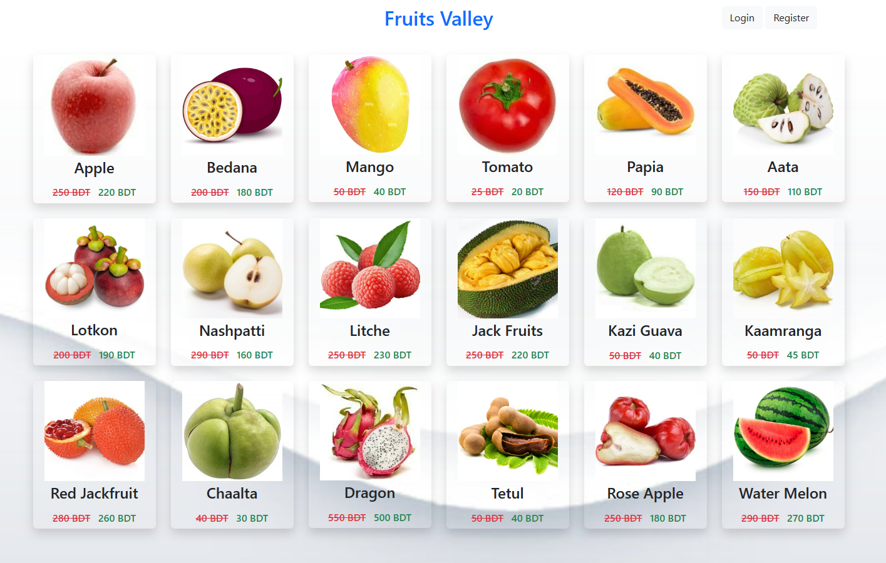
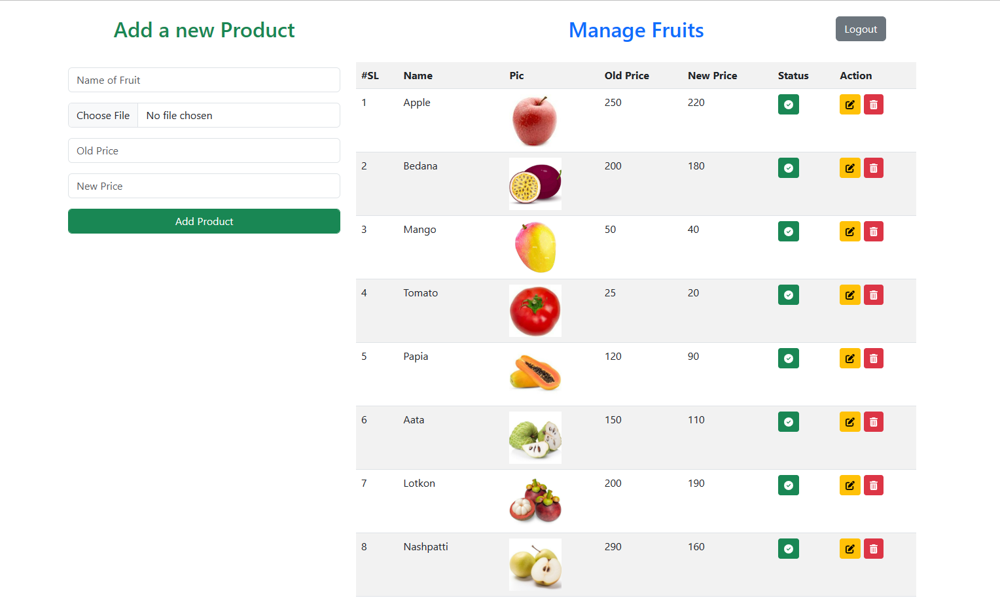
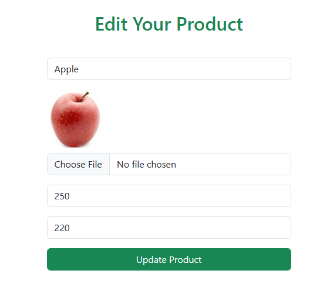

# Fruits Valley

Fruits Valley is a web application built on Laravel 10 that allows users to view pictures and prices of various fruits. The application also provides an admin panel where authorized users can manage fruits by adding, deleting, editing, and activating/inactivating them.

## Features

- User-friendly interface for browsing fruit pictures and prices.
- Admin panel for managing fruits:
  - Add new fruits with pictures, prices, and other details.
  - Delete existing fruits.
  - Edit fruit information such as name, price, and availability.
  - Activate or deactivate fruits based on availability.
- Authentication system implemented using Laravel Breeze.

## Prerequisites

Make sure you have the following dependencies installed on your system:

- PHP (>= 7.4)
- Composer
- Node.js (>= 12.x)
- NPM (>= 6.x)
- Laravel (10.x)

## Installation

1. Clone the repository: https://github.com/rezaul-rimon/fruits-valley.git

2. Navigate to the project directory: cd fruits-valley

3. Install PHP dependencies: composer install

4. Install JavaScript dependencies: npm install

5. Configure the environment variables: 

    - Rename the `.env.example` file to `.env`.
    - Update the necessary database and other configuration variables in the `.env` file.

6. Generate a new application key: php artisan key:generate

7. Run database migrations: php artisan migrate

8. (Optional) Seed the database with sample data: php artisan db:seed

9. Build the frontend assets: npm run dev

10. Start the development server: php artisan serve
 
11. Access the application by visiting `http://localhost:8000` in your browser.

## Usage

- As a user, you can browse the fruits by visiting the homepage. Prices and pictures of various fruits will be displayed.
- As an admin, you can access the admin panel by logging in with your credentials. From there, you can manage fruits by adding, deleting, editing, and activating/inactivating them.

## Acknowledgments

- Laravel: [https://laravel.com](https://laravel.com)
- Laravel Breeze: [https://laravel.com/docs/10.x/starter-kits#laravel-breeze](https://laravel.com/docs/10.x/starter-kits#laravel-breeze)

